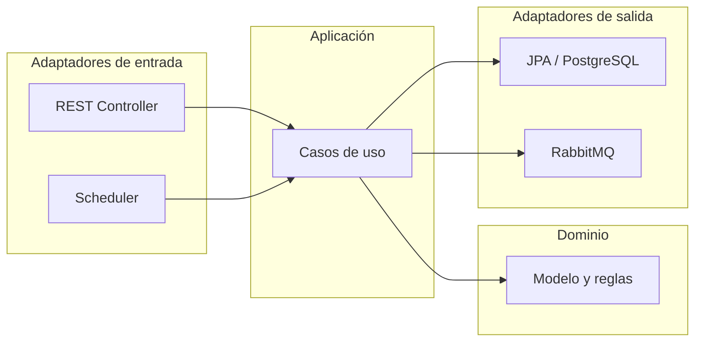

# Microservicio Dinosaur (AMB)

Microservicio **Spring Boot** para un flujo **AMB** (Alta, Modificación, Baja) de dinosaurios. La lógica de negocio está aislada del framework siguiendo una **arquitectura hexagonal** (puertos y adaptadores): dominio en el centro, casos de uso alrededor, infraestructura en los bordes.

**Stack:** Java 21, Spring Boot 3.5, PostgreSQL, RabbitMQ.

---

## Contenido

1. [Arquitectura](#arquitectura)
2. [Componentes del código](#componentes-del-código)
3. [Requisitos](#requisitos)
4. [Cómo levantar el proyecto](#cómo-levantar-el-proyecto)
5. [Configuración relevante](#configuración-relevante)
6. [API REST](#api-rest)
7. [RabbitMQ](#rabbitmq)
8. [Cómo ejecutar los tests](#cómo-ejecutar-los-tests)

---

## Arquitectura

El flujo general: el **adaptador de entrada** (HTTP o scheduler) invoca un **puerto de entrada** (interfaz del caso de uso); el caso de uso usa **puertos de salida** (persistencia, mensajería) implementados por **adaptadores de salida** (JPA, AMQP).



**Despliegue con Docker Compose:** el archivo `docker-compose.yml` puede levantar **tres servicios**: la aplicación (`app`, imagen construida con el `Dockerfile`), **PostgreSQL** y **RabbitMQ**. En el contenedor de la app, la URL JDBC y el host de RabbitMQ deben usar los **nombres de servicio** (`postgres`, `rabbitmq`), no `localhost`; eso se resuelve con variables de entorno en Compose (ver tabla más abajo).

---

## Componentes del código

| Paquete / capa | Rol |
|----------------|-----|
| `com.dinosaur.domain` | Entidades de dominio (`Dinosaur`, `DinosaurStatus`), excepciones de negocio, **puertos de salida** (`DinosaurPersistencePort`, `DinosaurMessagingPort`). Sin dependencias de Spring ni JPA. |
| `com.dinosaur.application` | **Puertos de entrada** (interfaces de casos de uso), implementaciones en `...service`, DTOs de aplicación (`DinosaurCommand`, `DinosaurResult`), mapeos. Orquesta el dominio y los puertos de salida. |
| `com.dinosaur.infrastructure.in` | **Entrada:** REST (`DinosaurController`, DTOs, `GlobalExceptionHandler`), configuración Spring (`ApplicationConfig` enlaza beans de casos de uso), `RabbitMQConfig`, **scheduler** (`DinosaurStatusScheduler`) que dispara actualización periódica de estados. |
| `com.dinosaur.infrastructure.out` | **Salida:** persistencia JPA (`DinosaurJpaEntity`, repositorio, `DinosaurPersistenceAdapter`), mensajería (`RabbitMQAdapter`, mensajes hacia el exchange/cola configurados). |

**Comportamiento destacado:** el scheduler ejecuta periódicamente el caso de uso que revisa dinosaurios al borde de extinción o extintos, actualiza estado y publica eventos en RabbitMQ. La expresión cron se define en `application.properties` (`scheduler.cron-expression`; por defecto en el repo suele ser cada minuto en desarrollo).

---

## Requisitos

- **Docker** y **Docker Compose** (stack completo en contenedores, y tests de integración con Testcontainers).
- **Java 21** y **Maven 3.9+** (opcionales si solo usas Docker para correr la app; necesarios para `mvn spring-boot:run`, empaquetar o ejecutar tests en la máquina host).

---

## Cómo levantar el proyecto

1. Clonar el repositorio e ir al directorio del proyecto.

### Opción A — Todo con Docker Compose (recomendado)

Construye la imagen de la app (multi-stage: Maven + JRE) y levanta app, Postgres y RabbitMQ. La primera vez conviene forzar build:

```bash
docker compose up --build -d
```

Servicios:

| Servicio | Uso | Puerto(s) en el host |
|----------|-----|----------------------|
| `app` | Microservicio Spring Boot | `8080` |
| `postgres` | Base `dinosaur`, usuario/contraseña `postgres` / `postgres` | `5432` |
| `rabbitmq` | AMQP y consola de gestión | `5672` (AMQP), `15672` (UI) |

La app **espera** a que Postgres y RabbitMQ estén *healthy* (`depends_on` con condición de salud).

La API queda en **http://localhost:8080**.

### Opción B — Solo infraestructura en Docker, app en el host

Útil para desarrollo sin reconstruir la imagen en cada cambio:

```bash
docker compose up -d postgres rabbitmq
mvn spring-boot:run
```

En ese caso `application.properties` apunta a `localhost:5432` y `localhost:5672`, que coinciden con los puertos publicados por los contenedores.

### Opción C — JAR en el host

Con Postgres y RabbitMQ ya disponibles (por ejemplo vía Compose):

```bash
mvn -q -DskipTests package
java -jar target/dinosaur-0.0.1-SNAPSHOT.jar
```

**Dockerfile:** build en dos etapas (`maven:3-eclipse-temurin-21` → `eclipse-temurin:21-jre`), copia el JAR `dinosaur-0.0.1-SNAPSHOT.jar`. El archivo `.dockerignore` reduce el contexto de build (por ejemplo excluye `target/`).

---

## Configuración relevante

Valores por defecto en `src/main/resources/application.properties` (aptos para **Opción B/C** con servicios en `localhost`):

- **PostgreSQL:** `jdbc:postgresql://localhost:5432/dinosaur`
- **RabbitMQ:** host implícito `localhost` (puerto `5672` por defecto del cliente Spring)
- **Exchange / cola / routing key:** `rabbitmq.exchange`, `rabbitmq.queue`, `rabbitmq.routing-key`
- **JPA:** `ddl-auto=update` (útil en desarrollo; revisar para entornos productivos)

Para la **Opción A** (app dentro de Docker), `docker-compose.yml` define variables que Spring Boot interpreta y **sobrescriben** esos valores:

| Variable | Valor en Compose | Motivo |
|----------|------------------|--------|
| `SPRING_DATASOURCE_URL` | `jdbc:postgresql://postgres:5432/dinosaur` | El host `postgres` es el nombre del servicio en la red de Compose. |
| `SPRING_DATASOURCE_USERNAME` / `SPRING_DATASOURCE_PASSWORD` | `postgres` / `postgres` | Alineado con el servicio `postgres`. |
| `SPRING_RABBITMQ_HOST` | `rabbitmq` | Mismo criterio para el broker. |
| `SPRING_RABBITMQ_PORT` | `5672` | Puerto AMQP dentro de la red. |

Si cambias puertos o credenciales en `docker-compose.yml`, actualiza las propiedades o estas variables de entorno en el servicio `app`.

---

## API REST

### Crear

`POST /dinosaur`

```json
{
  "name": "Tyrannosaurus Rex",
  "species": "Theropod",
  "discoveryDate": "1902-01-01T23:59:59",
  "extinctionDate": "2023-12-31T23:59:59"
}
```

### Listar todos

`GET /dinosaur`

### Obtener por id

`GET /dinosaur/{id}`

### Actualizar

`PUT /dinosaur/{id}`

```json
{
  "name": "T-Rex Modificado",
  "species": "Theropod",
  "discoveryDate": "1902-01-01T23:59:59",
  "extinctionDate": "2026-12-31T23:59:59",
  "status": "ALIVE"
}
```

### Eliminar

`DELETE /dinosaur/{id}`

---

## RabbitMQ

- **Consola de gestión:** http://localhost:15672  
- **Credenciales por defecto de la imagen:** usuario `guest`, contraseña `guest`  
- Revisa **Exchanges** y **Queues** para la cola configurada (por defecto `dinosaur.status.queue`).

---

## Cómo ejecutar los tests

| Tipo | Qué valida | Herramientas |
|------|-------------|--------------|
| **Unitarios** | Casos de uso con dependencias simuladas; controlador web con `MockMvc` y mocks de puertos | JUnit 5, Mockito |
| **Integración** | API completa contra PostgreSQL y RabbitMQ reales levantados por contenedores efímeros | Spring Boot Test, Testcontainers |

**Requisito:** Docker en ejecución (Testcontainers necesita poder crear contenedores).

Ejecutar toda la suite:

```bash
mvn clean test
```

Ejecutar una clase concreta, por ejemplo solo tests unitarios del controlador:

```bash
mvn test -Dtest=DinosaurControllerTests
```

O solo integración del controlador:

```bash
mvn test -Dtest=DinosaurControllerIntegrationTests
```

Los tests de integración declaran contenedores estáticos (`PostgreSQLContainer`, `RabbitMQContainer`) y registran propiedades dinámicas para que el contexto Spring use esas instancias en lugar de `localhost`.
